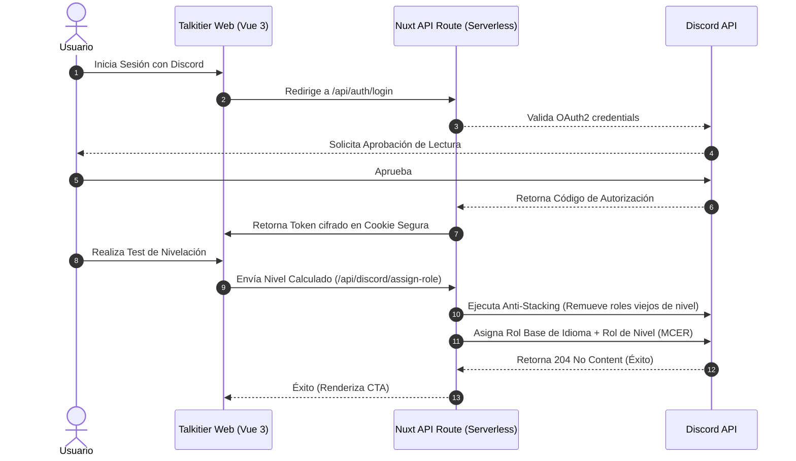

# Talkitier 🚀 — Plataforma de Nivelación de Idiomas e Integración de Discord

Talkitier es una landing page premium y plataforma de testing de alta fidelidad diseñada para evaluar los niveles de competencia en idiomas extranjeros de acuerdo al Marco Común Europeo de Referencia (MCER). Está directamente conectada mediante OAuth2 y un bot a servidores de Discord para la asignación y sincronización de roles automatizados.

---

## 🛠️ Stack Tecnológico & Arquitectura Serverless

### ¿Es Serverless?
**Sí, Talkitier es 100% Serverless nativo.**
La aplicación está construida sobre **Nuxt 3** y utiliza **Nitro** como motor de servidor backend integrado. Nitro compila las rutas de API backend (`server/api/...`) en funciones serverless independientes (Lambdas), listas para ser desplegadas sin necesidad de mantener un servidor dedicado.
* **Compatibilidad de Despliegue**: Despliegue en 1 clic en plataformas serverless como Vercel, Netlify, Cloudflare Workers, AWS Lambda o Firebase App Hosting.
* **Base de Datos / Estados**: El flujo de autenticación es sin estado (Stateless) empleando cookies seguras cifradas, lo que garantiza escalabilidad horizontal infinita.

### Frontend
* **Core**: Vue 3 (Composition API con `<script setup lang="ts">`).
* **Estilos**: Tailwind CSS con paleta de marca Talkitier personalizada (Aesthetics Premium).
* **Gestión de Estados**: Reactividad nativa en Vue 3 y composables de estado seguro.

### Backend & Integraciones
* **Motor Serverless**: Nitro Engine de Nuxt 3.
* **Integración de Discord**: Bot de Discord corporativo conectado de forma asíncrona mediante HTTPS con tokens firmados para actualizar roles y resolver la jerarquía del servidor.

---

## 📐 Flujo de Arquitectura y Sincronización



---

## 📋 Especificaciones de Diseño y Características Premium

### 1. Panel de Comenzar Test responsivo (Mobile-First)
* Al iniciar sesión y hacer clic en **Comenzar Test**, se despliega un panel flotante de alta fidelidad responsivo con tarjetas descriptivas individuales para cada idioma disponible:
  * **Deutsch (Alemán)**
  * **Português (Portugués)**
  * **English (Inglés)**
  * **Español (Español)**
  * **Italiano (Italiano)**
* Cada tarjeta cuenta con su bandera SVG embebida vectorizada y una descripción optimizada de la prueba.

### 2. Carrusel de Idiomas General (Informativo)
* Ubicado en la Landing Page, rediseñado para ser puramente informativo, visualmente atractivo y sin redirección automática al test al ser clickeado.
* Cuenta con **micro-animaciones premium**: escalado a `scale-[1.02]`, realce de bordes y sombras profundas (`shadow-xl`) al pasar el cursor.
* **Tarjeta Flotante 3D**: Al interactuar con las flechas laterales de navegación del carrusel, se despliega una tarjeta física 3D con un diseño moderno de marca indicando: `🌍 ¡Más idiomas próximamente!`.

### 3. Sincronización de Roles Inteligente (Anti-Stacking)
* Cuando el usuario finaliza la autoevaluación, el backend detecta el idioma evaluado y el nivel.
* Para evitar conflictos de roles acumulados (Stacking), el backend remueve todos los niveles anteriores de ese idioma (por ejemplo, remueve *Alemán A1* si se alcanza *Alemán B2*) antes de asignar el nuevo nivel.
* Asigna en la misma llamada **dos roles**: el rol de idioma genérico (ej. *Portugués*) para control estadístico global y el rol de nivel específico (ej. *Portugués B2*).
* **Mecanismo de Resiliencia**: Si el usuario aún no forma parte del servidor de Discord, la plataforma ofrece un flujo guiado en 2 pasos:
  1. Botón directo de invitación al servidor oficial (`https://discord.gg/jHN3amJyZu`).
  2. Botón interactivo de sincronización manual para reintentar la asignación de roles.

---

## 🚀 Guía de Configuración y Desarrollo

### 1. Variables de Entorno (`.env`)
Configura el archivo `.env` en la raíz del proyecto con las credenciales de tu aplicación Discord:

```env
# Discord OAuth2 Config
NUXT_DISCORD_CLIENT_ID=tu_client_id
NUXT_DISCORD_CLIENT_SECRET=tu_client_secret
NUXT_DISCORD_REDIRECT_URI=http://localhost:3000/api/auth/callback

# Discord Bot Config (Para asignación serverless de roles)
NUXT_DISCORD_BOT_TOKEN=tu_bot_token
NUXT_DISCORD_GUILD_ID=tu_guild_id
```

### 2. Ejecutar Servidor de Desarrollo
Instala las dependencias y corre el servidor de desarrollo local:

```bash
# Instalar dependencias
pnpm install

# Iniciar servidor local
pnpm run dev
```
El servidor estará listo en `http://localhost:3000`.

### 3. Compilación de Producción
Para desplegar la aplicación en cualquier backend de computación serverless, compila el bundle estático y dinámico de Nitro:

```bash
pnpm run build
```
Nitro generará el build optimizado en el directorio `.output/`, listo para ser desplegado.
